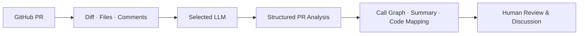

# PRiday

> Understand the change before you approve it.

**PRiday** is an AI code review assistant that helps you understand Pull Requests faster and more deeply.

The name combines **PR + Friday**. Like F.R.I.D.A.Y., the AI assistant that helps Iron Man make sense of complex situations, PRiday stays beside the reviewer and explains the structure and context of code changes. It does not approve reviews on your behalf; it helps people ask better questions and make better decisions.

> The current development preview still displays the former name, `AI PR Insight`, in parts of the VS Code UI and command names.

## Why PRiday?

Vibe coding and coding agents have dramatically increased the speed at which software is created. At the same time, they have widened the gap between **how quickly code is generated and how quickly people can understand it**.

PRiday focuses on the **understanding debt** created by this gap.

- LLM-generated code accumulates quickly, while teams may not fully understand its intent or behavior.
- Code that nobody understands can reduce PR review to a superficial approval process.
- Technical discussions and architecture decisions built on incomplete understanding are likely to rely on faulty assumptions.
- Deferred understanding costs eventually return as greater technical debt during debugging, maintenance, and onboarding.

PRiday summarizes changed code, connects call relationships to the actual implementation, and lets reviewers ask questions within the context of a PR. Its goal is not simply to shorten review time, but to help reviewers **build an accurate mental model in less time**.

## Demo

### Start a PR analysis

Select an open Pull Request from the sidebar and launch the analysis directly inside VS Code.


### Explore the analysis

Navigate the PR summary, call graph, in-depth explanations, code mappings, and changed files in one interactive workspace.


## Features

### PR discovery and analysis

- Automatically detects GitHub remotes in the current workspace.
- Lists open PRs in the VS Code sidebar and starts an analysis with one click.
- Accepts a repository and PR number directly from the Command Palette.
- Analyzes the PR description, changed files, diff, and existing issue and review comments together.
- Displays progress throughout each stage of the analysis.

### An interactive review workspace

- **PR Summary**: Shows the purpose of the change, branches, per-file statistics, and an overall summary.
- **Call Graph**: Visualizes function and class call relationships as a tree for each file.
- **In-depth Analysis**: Explains the role and key changes of important code blocks step by step.
- **File Viewer**: Displays changed files and their unified diffs inside the analysis workspace.
- **Summary ↔ Code Mapping**: Select an explanation to jump to related code, or select code to find its explanation.
- **Ask AI**: Answers follow-up questions using the current diff, file contents, existing comments, and analysis results.
- **GitHub Comments**: Posts review comments on selected code or general comments on the PR.

### Bring your preferred LLM

PRiday supports the following providers:

- **Google Gemini** — default: `gemini-2.5-flash`
- **Anthropic Claude** — default: `claude-sonnet-4-20250514`
- **OpenAI** — default: `gpt-5.5`
- **Ollama** — default model: `llama3`, default endpoint: `http://localhost:11434`

You can change the model in the settings or enter a model name that is not listed through the Command Palette. Model availability depends on your provider account and its current API policies.

## How It Works



1. PRiday fetches PR metadata, changed files, diffs, and existing comments from GitHub.
2. The selected LLM analyzes the structure, call relationships, and key logic in a structured format.
3. AST information and text similarity connect each explanation to the relevant code lines.
4. The results become an interactive Call Graph, file viewer, and chat workspace inside VS Code.

## Getting Started

PRiday is currently a **development preview** and is not yet distributed through the VS Code Marketplace. The following environment is required to run it from source.

### Prerequisites

- VS Code `1.85.0` or later
- Node.js 20 or later recommended
- Git
- GitHub Personal Access Token
- An API key for a supported LLM, or a local Ollama instance

### 1. Clone and build

```bash
git clone https://github.com/jaewooMaeng/PRiday.git
cd PRiday
npm install
npm run compile
code .
```

Press `F5` in VS Code or select **Run and Debug → Run Extension**. In the new **Extension Development Host** window, open the GitHub repository you want to review.

### 2. Connect GitHub and an LLM

Open the Command Palette (`Cmd/Ctrl + Shift + P`) and run the following commands in order:

1. `AI PR Insight: Set GitHub Token`
2. `AI PR Insight: Set LLM Provider`
3. `AI PR Insight: Set LLM Model`
4. `AI PR Insight: Set LLM API Key` — skip this step when using Ollama

GitHub tokens and LLM API keys are stored in VS Code `SecretStorage` and are never written to `settings.json` in plain text.

### 3. Select a PR and analyze

1. Open the **AI PR Insight** icon in the Activity Bar.
2. Expand your repository under **Open Pull Requests**.
3. Click the **▶** button next to the PR you want to analyze.
4. Wait for `Fetching PR → LLM analysis → AST parsing → Code mapping` to finish.
5. Explore the Call Graph, detailed explanations, File Viewer, and Ask AI in the analysis workspace.

If your repository does not appear in the sidebar, make sure its Git remote points to `github.com`, then click the refresh button.

To open a PR from another repository directly, run `AI PR Insight: Analyze Pull Request` from the Command Palette and enter the `owner/repository` and PR number.

## Connecting an LLM

### Gemini, Claude, or OpenAI

The simplest way to configure a cloud provider is through the Command Palette.

1. Select a provider with `AI PR Insight: Set LLM Provider`.
2. Choose or enter a model with `AI PR Insight: Set LLM Model`.
3. Store the provider API key with `AI PR Insight: Set LLM API Key`.
4. Open **⚙** in the upper-right corner of the analysis workspace and test the connection.

The settings panel lets you update the provider, model, API key, GitHub token, output language, and workspace-specific analysis instructions in one place. Select **Save and reanalyze** to run the current PR again with the new settings.

### Ollama

To use a local model without an API key, start Ollama and prepare a model:

```bash
ollama pull llama3
ollama serve
```

Then select **Ollama** with `AI PR Insight: Set LLM Provider`. The default endpoint is `http://localhost:11434`, and the default model is `llama3`.

To use a remote Ollama server or another model, update these values in VS Code Settings:

- `aiPrInsight.llm.ollamaEndpoint`
- `aiPrInsight.llm.ollamaModel`

## Configuration

Search for `AI PR Insight` in VS Code Settings, or edit the following settings directly:

- `aiPrInsight.llm.provider`: `ollama`, `gemini`, `claude`, `chatgpt`
- `aiPrInsight.llm.ollamaEndpoint`: Ollama API endpoint
- `aiPrInsight.llm.ollamaModel`: Ollama model
- `aiPrInsight.llm.geminiModel`: Gemini model
- `aiPrInsight.llm.claudeModel`: Claude model
- `aiPrInsight.llm.chatgptModel`: OpenAI model
- `aiPrInsight.llm.language`: Analysis output language, `ko` or `en`
- `aiPrInsight.llm.additionalSystemPrompt`: Additional analysis criteria for the current workspace

`additionalSystemPrompt` applies to the initial PR analysis and reanalysis, but not to Ask AI conversations.

## GitHub Token

PRiday uses a GitHub PAT to read PRs and publish comments. The current token prompt recommends the `repo` scope for classic PATs. Follow the principle of least privilege based on your organization policy and whether the target repository is public or private.

- Reading a PR requires repository and Pull Request read access.
- Publishing comments from PRiday requires Pull Request write access.
- Replace the token through `AI PR Insight: Set GitHub Token` or the analysis settings panel.

## Development

```bash
# Build the Extension and Webview
npm run compile

# Rebuild on changes
npm run watch

# Check TypeScript
npm run check-types

# Run Jest unit tests
npm test
```

Debug logs are available under VS Code **Output → AI PR Insight**.

## Current Limitations

- Only GitHub repositories are currently supported.
- PRiday must be run through the Extension Development Host until a Marketplace package is available.
- AST extraction falls back to regular expressions when tree-sitter grammar WASM files are unavailable.
- Large PRs are affected by provider context limits, response times, and API costs.
- LLM analysis supports reviewer judgment; it does not guarantee correctness or replace a security review.

## Contributing

PRiday started from the belief that the industry needs not only tools that generate more code, but also tools that help people **understand generated code more effectively**.

For ideas, bug reports, feature development, or any other contribution, contact [jwmaeng@snu.ac.kr](mailto:jwmaeng@snu.ac.kr).

